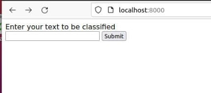

# Web-Based Machine Learning System

[](https://app.travis-ci.com/RaghadKhaled/Workshop2)

---

This is a project required for a Software Engineering2 course.<br>
It is done as teamwork by Alhanouf Almansour and Kholod Alnufaie and Raghad Albosais.

---
## Table of content
- Project overview
- Development environment requirements
- How to install
- How to use
- Travis CI tool integration 
- Releases
- Contributors 
---

### Project overview
The purpose of the project is to gain a knowledge of currently challenges of software engineering activities and the skills to apply them.  <br>
The project is divided into two take, the first task is to run the first version of a developed web-based machine learning system for simple text classification (form this repo in GitHub) and create a repo, put in it the code after completing the run, create the tag, and put the first release in the repo.<br>
The second task is to integrate and run Travis CI in this repo, and update the user interface page. 

---

### Development environment requirements
- VM 
- Ubuntu OS in VM

---

### How to install

Download the three files (index.html, index.js, and train.txt) in your ubuntu environment.
Next, follow the steps below to set up a Node js server to run the core system of the machine learning (fasttext tool for text classification) on input from a user.
1. Download npm: 
```
sudo apt install npm 
```
2. Create and open project folder:
```
mkdir [your choice name] 
```
3. Initialize requirements: 
```
npm init -y 
```
4. Add index.html,index.js and train.txt in the same folder.
5. Install the Node.js sandbox for the Machine learning algorithm (fasttext): 
```
npm install nodefasttext --save 
```
6. Install Express: 
```
npm install express --save 
```
7. Install some cors issues: 
```
npm install cors --save 
```
8. Now if you want to get this sandbox up and running pretty quick you go ahead and use my HTML and J's files (provided on this URL) and once you have done. 
9. Run index.js: 
```
node index.js
```
---

### How to use
After you install it, the result of the last command will provide to your localhost port number, open it in your browser by typing “localhost:8000” and HTML page showen below will appear accordingly.<br><br>


Next, you can type text to be classified and test if its success, for example, type ”baked potatoes”. <br><br>


The result on HTML page appears "success" and in the terminal illustrates all possible labels for that text.<br><br>
<br><br>


---

### Travis CI tool integration 


I have used the Travis Continues Integration tool to set up a build pipeline.
The following steps show how to set up and run Travis CI in the project.<br><br>

1-Open  [Travis CI](https://www.travis-ci.com/) and sign in with your GitHub account.<br><br>
2-Add this repository to your account at Travis CI and enable it.<br><br>
3-Add .travis.yml file in the repository with this code<br>

```
Language: node_js
Node_js: 
 -7
```
<br>
4-Update package.JSON file in <br><br>

```
"scripts": {
  "test": "echo \"Error: no test specified\" && exit 1"
}, 
```
to be <br>
```
 "scripts": {
  "test": "echo \"No test specified\""
}, 
```
<br>
5-After steps three and four, Travis will work and perform the test operations.<br><br>

6-After that, copy the URL of the project state icon and paste it into the README file.<br>
this icon will show whether the state of the program is pass or fail.

<br><br><br>
I have faced some issues during linking the repository with Travis IC.<br>
1- To link the repository in Travis CI, it is required to enter your Credit Card information.<br>
2- when updating package.JSON and performing the testing, I faced errors indicating that fasttext node file does not exist. but after I wrote what I mentioned in step four, it does work.


---

### Releases
The first release with tag v0.0.0 is created with the same code we have run it.<br> 

And the second release v0.1.0 with additional features in UI.<br>
I add the name of the system, logo, and clear button.<br><br>


<br><br>

After clicking to clear button, it will cleat the text entered in the text area and let the user be able to change/update the text before sending it to the server. 
As shown in the images below.<br><br>


<br><br>
<br><br>

After clicking to submit button, it dynamically shows the result (text with its corresponding label) of classification in a table after has been analyzed. As shown in the images below.

<br><br>


<br><br>
<br><br>


---

### Contributors 

Made with [Kholod Alnufaie](https://github.com/hkh7897) and [Alhanouf Almansour](https://github.com/AlhanoufAlmans)
